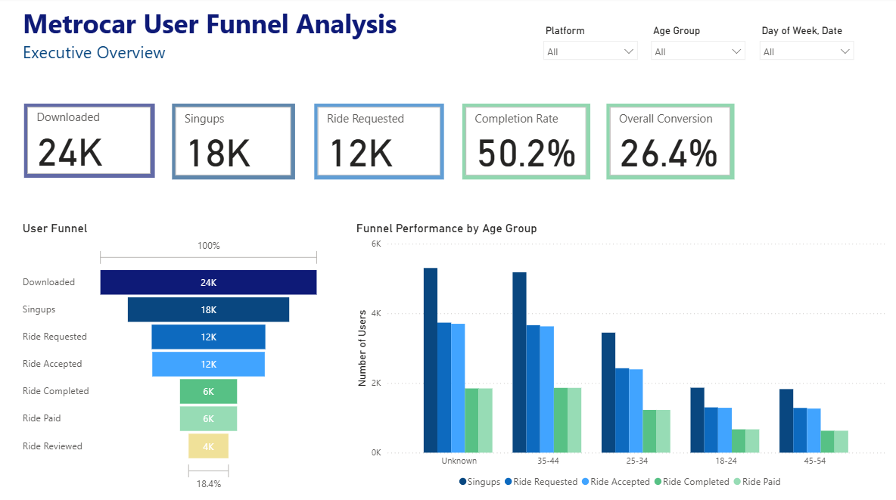
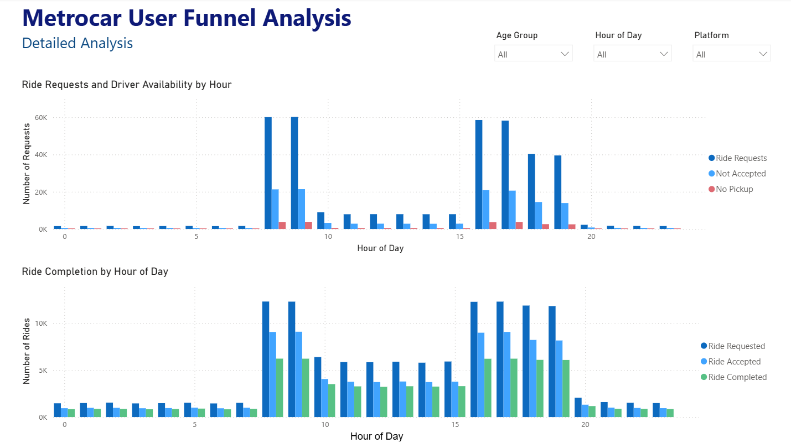

# Metrocar User Funnel Analysis

## Project Overview

This project analyzes the Metrocar user funnel to identify drop-off points and understand user behavior across different stages of the customer journey.

## Tools Used

- SQL
- Power BI
- Excel

## Dashboard

Power BI dashboard screenshots:

## Power BI File

The interactive Power BI dashboard can be downloaded here:

https://drive.google.com/file/d/1K5RTkpDjRjDwuIWURYM0T-DYGZzJdFy3/view?usp=drive_link

## Files

- Metrocar_Report.pdf
- Metrocar_queries.pdf
- dashboard_executive_overview.png
- dashboarddetailed_analysis.png

## Key Findings

- Only about 50% of requested rides are completed.
- User activity peaks during morning and evening commuting hours.
- The 35–44 age group generates the highest number of completed rides.
- Significant user drop-off occurs between signup and completed ride stages.

## Recommendations

- Improve onboarding after signup.
- Increase driver availability during peak hours.
- Target high-performing age groups with marketing campaigns.
- Investigate reasons for ride abandonment.
